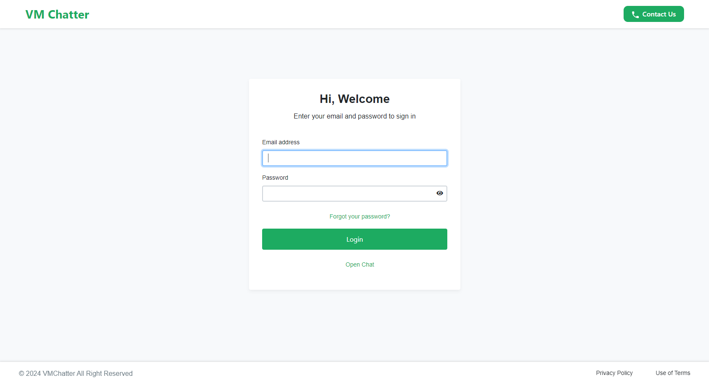
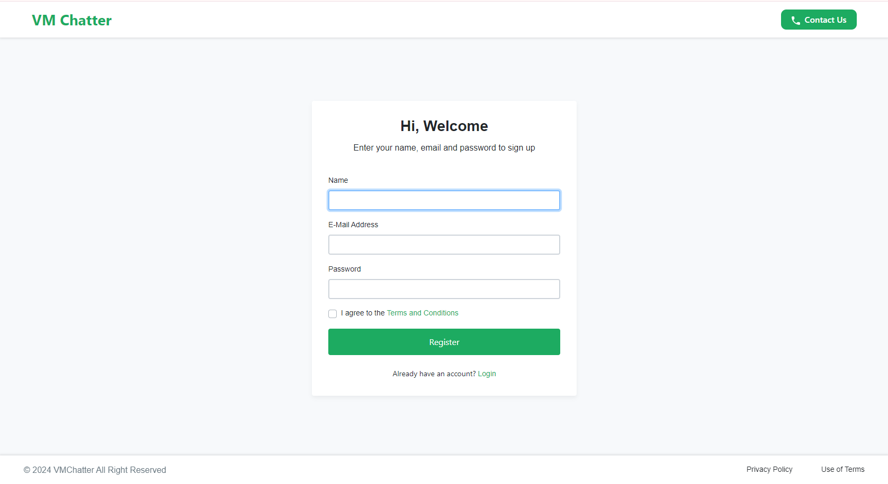
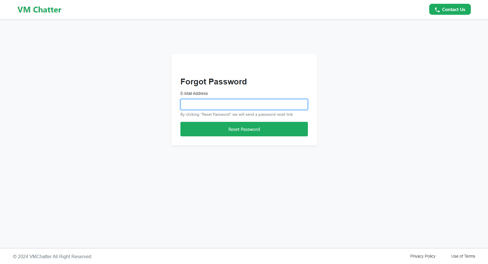
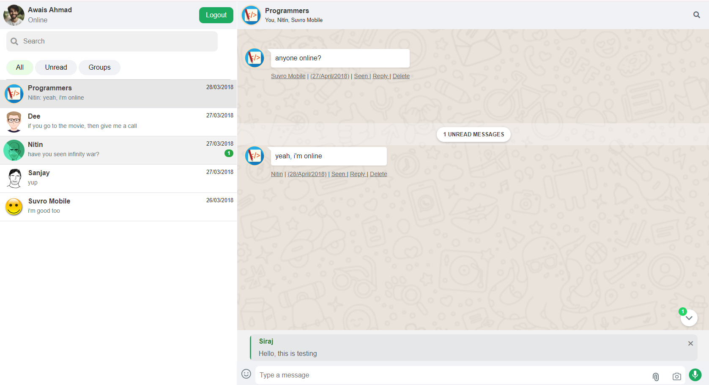
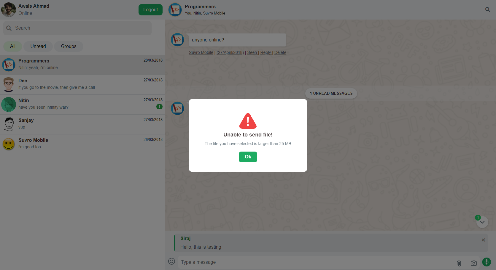
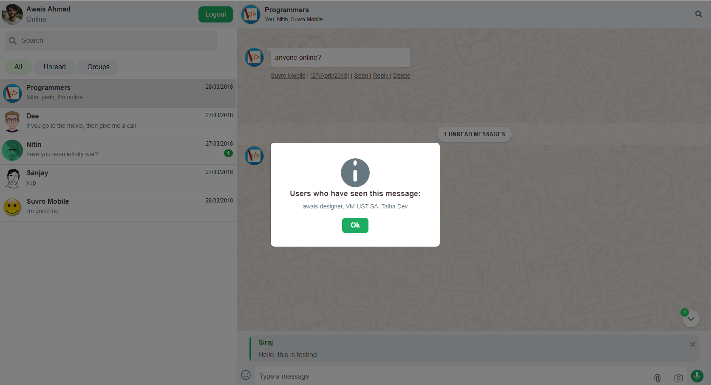
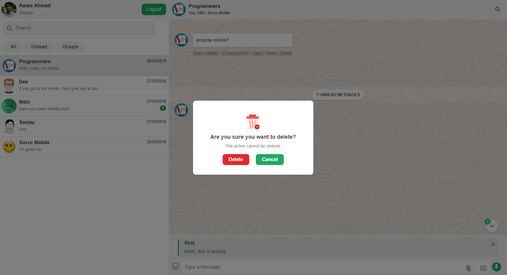

# WhatsApp Chat Design

This repository contains a chat interface design inspired by WhatsApp. It includes features such as user login, signup, and forgot password functionalities, along with other WhatsApp-like features.

## Features

- **Login**: User authentication with email and password.
  
- **Signup**: New user registration with form validation.
  
- **Forgot Password**: Password reset functionality.
  
- **Chat Interface**: 
  - Real-time messaging
  - Emoji picker
  - Notification icon with count
  - Voice recording feature
  - Responsive design
  - Reply Back Option
  - User Seen Popup
  - File Max Size Popup
  - Delete Confirmation 

   
  
  
  

## Installation

1. **Clone the Repository**:
   ```bash
   [git clone https://github.com/yourusername/whatsapp-chat-design.git]
